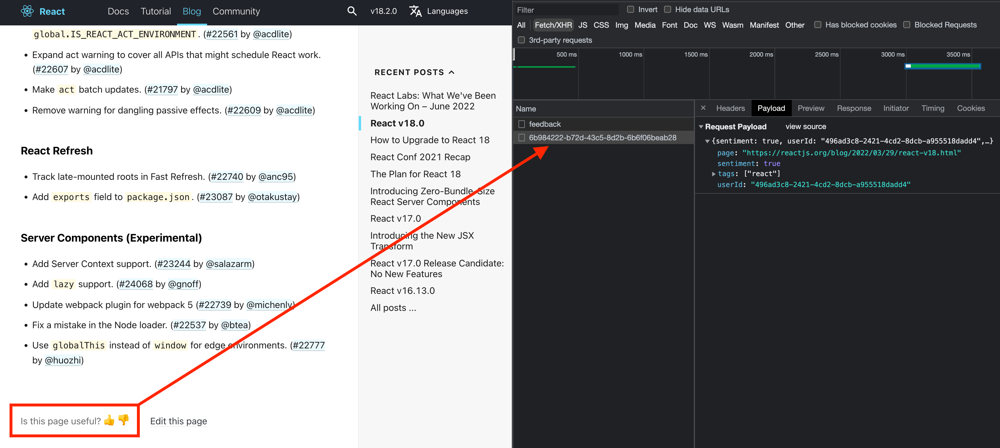

# Embedding the Feedback API snippet into your blog site

1. Add a div container with some ID for every page where you want to collect a feedback from users.
Example `

`.
2. Insert the [snippet](index.html) into your HTML file.
3. Fill in the [config object](https://github.com/yarokon/feedback-api-examples/blob/879373af7b30d382128266b09df10051995da1d3/examples/vanilla-js-snippet/index.html#L3-L7)
with your `rapidApiKey` and `selector` of the container where feedback component will be inserted.
4. Optionally you can change the [content](https://github.com/yarokon/feedback-api-examples/blob/main/examples/vanilla-js-snippet/index.html#L9-L17) of the template.

Now your blog will collect feedback, and you can check them all by executing `getFeedback` from your [portal](https://rapidapi.com/blips-and-chitz-blips-and-chitz-default/api/feedback-api5) and filter them by context.

