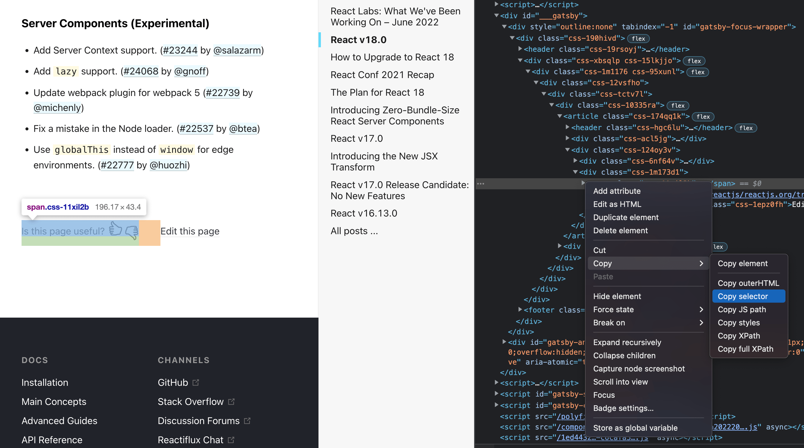
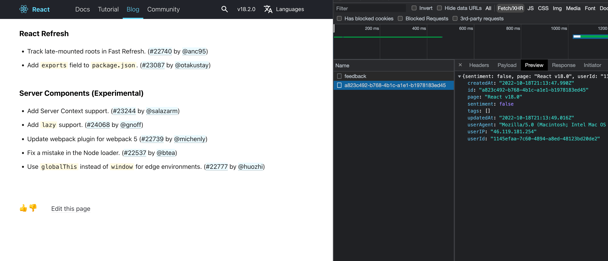

# Embedding the Feedback API snippet

In this tutorial, we'll show you how you can easily integrate Feedback API into any blog page with just one snippet of code.
Let's open some [React blog page](https://reactjs.org/blog/2022/03/29/react-v18.html). Scroll to the bottom of the page and copy the selector
of the current feedback element that we are going to replace.



Open `index.js` and paste selector, your [rapidApiKey](https://rapidapi.com/blips-and-chitz-blips-and-chitz-default/api/feedback-api5) and additional context into IIFE

```json
{
  "rapidApiKey": "637316bb60msh72029ce58a98a83p19d6d5jsnb9fefc607f61",
  "selector": "#gatsby-focus-wrapper > div > div > div > div > div > div > article > div.css-124oy3v > div.css-1m173d1 > span",
  "context": {
    "page": "React v18.0"
  }
}
```

Copy and paste this snippet into the console. Press enter.



You should see that rating icons will be replaced with new ones. Now you can try to send feedback and edit it. After that you can visit [Feedback API portal](https://rapidapi.com/blips-and-chitz-blips-and-chitz-default/api/feedback-api5)
and see your feedback by executing `getFeedbak` with `page="React v18.0"`.
